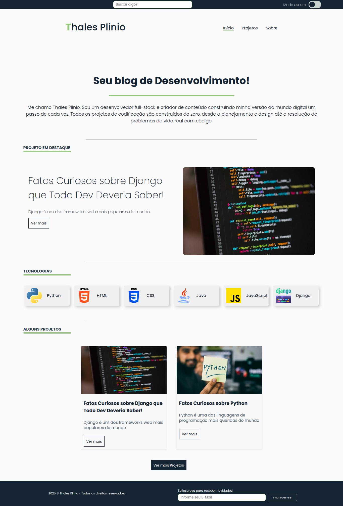
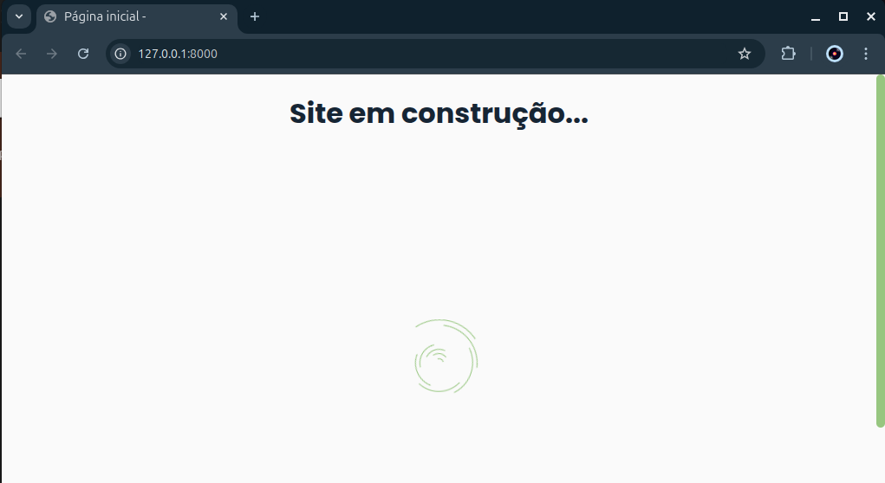
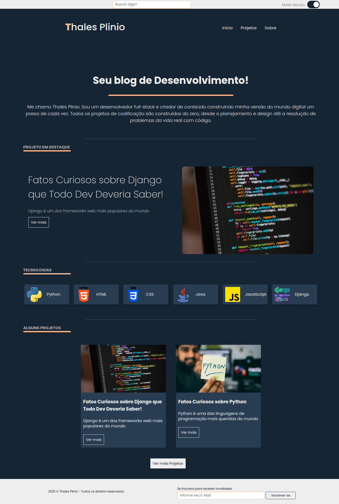
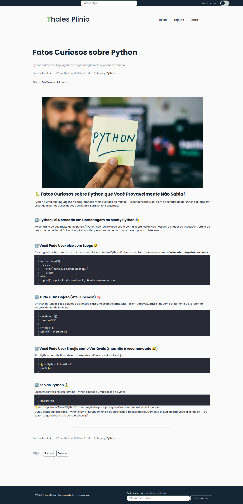
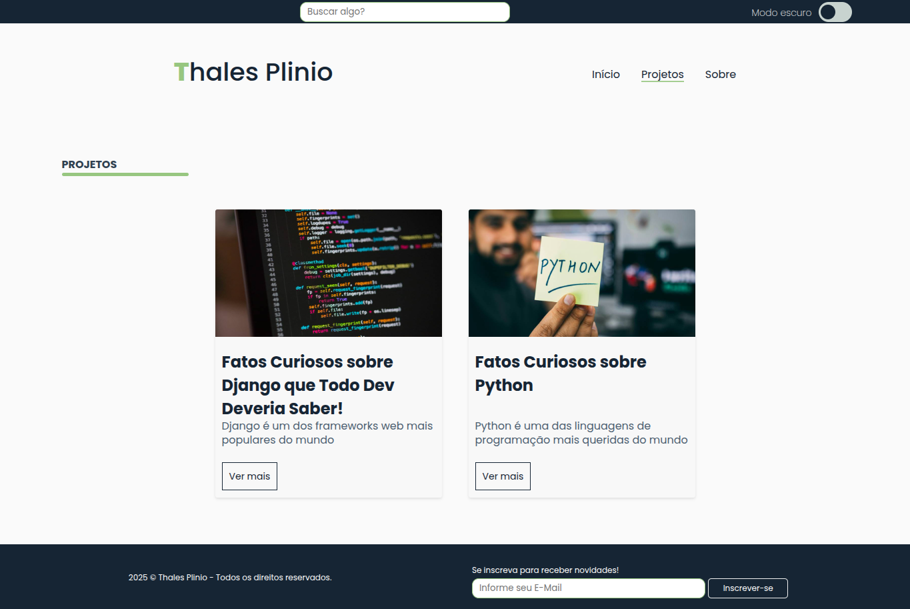

<h1 style="text-align:center;">Blog Com Django e PostegreSQL</h1>

[](https://GitHub.com/Naereen/StrapDown.js/graphs/commit-activity)


</br>


</br>
</br>

<p align="center">
    
</p>

Status: Em desenvolvimento.

### 💻 Blog com Django e PostgreSQL, um pequeno portfólio para devs.

#### Sobre o projeto

#### 📌 <em>Este projeto foi feito para fins de estudos da linguagem python utilizando o framework Django com o banco de dados PostgreSQL, conta com a própria área administrativa do django onde pode ser feito as configurações do site e suas postagens.</em>

#### Tecnologias utilizadas

- Python 3.13
- Django 5.0
- PostgreSQL 16.8

## 🚀 Iniciando o projeto

> <em>Baixe o projeto e execute os comandos.</em>

- 🔧 Para linux

```Python
# Criando ambiente virtual
python3 -m venv venv

# Ativando o ambiente virtual
sourve venv/bin/activate
```

- 🔧 Para windows

```Python
# Criando ambiente virtual
python -m venv venv

# Ativando o ambiente virtual
venv/Scripts/Activate
```

- Instale as depencencias contidas em requirements.txt

```python
# No terminal execute
pip install -r requirements.txt
```

#### 📌 Para que o Django funcione perfeitamente adicione suas configurações do postgres no arquivo .env (após inserido remova o '-exemple' deixando apenas .env), execute os seguintes comandos para fazer as migrações do banco de dados.

```python
# No terminal execute
python manage.py makemigations
python manage.py migrate
```

### Se deu tudo certo você verá uma página assim

<p align="center">
    
</p>
### 📌 Agora precisamos criar um super usuário para acessar a área administrativa e fazer as configurações do site.

```python
# No terminal execute
python manage.py createsuperuser
```

> <em>Crie um super usuário entre na área administrativa e crie suas configurações</em> </br>

> <em>Em site Setup é onde deve ser feito as configurações como nome do site, descrições e o que deseja mostrar.</em> </br>

> <em>Em Blog é onde deve ser feito as configurações para o blog, como tags, categorias e posts, e tem uma área para 'sobre mim' onde configurei para mostar um pequeno resumo sobre mim.</em> </br>

## 📌 Mais imagens do projeto

- ### Tela inicial com site com o tema escuro aplicado

<p align="center">
    
</p>

---

- ### Página da postagem
<p align="center">
    
</p>

---

- ### Menu projetos, listando projetos ou postagens com noticias.
<p align="center">
    
</p>

#### Autor: Thales Plinio.
